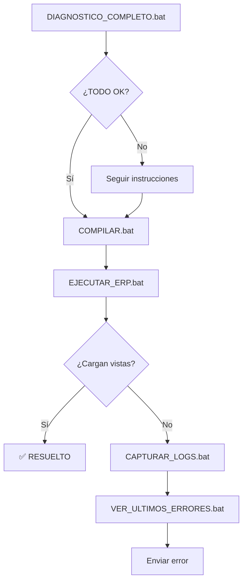

# 🔍 NO CARGAN LAS VISTAS - ¿QUÉ HACER?

## 🎯 INICIO RÁPIDO

### **Ejecuta esto AHORA:**

```batch
DIAGNOSTICO_COMPLETO.bat
```

Este script te dirá **exactamente** qué está mal y qué hacer.

---

## 📋 3 ESCENARIOS POSIBLES

### ✅ **Escenario 1: "TODO PERFECTO"**

Si el diagnóstico dice que todo está OK:

```batch
# 1. Compilar
COMPILAR.bat

# 2. Ejecutar
EJECUTAR_ERP.bat

# 3. Si SIGUE sin cargar las vistas:
CAPTURAR_LOGS.bat

# 4. Ver qué error da:
VER_ULTIMOS_ERRORES.bat
```

---

### ⚠️ **Escenario 2: "ADVERTENCIAS - Controladores faltantes"**

Si dice que faltan controladores:

**Esto es NORMAL**. Significa:
- ✅ Los archivos FXML existen
- ✅ El CSS está OK
- ⚠️ Algunos controladores Java no están implementados

**Qué esperar:**
- Solo funcionarán las vistas con controlador (Clientes, Artículos, Facturas)
- Las demás darán error al abrirlas

**Solución:**
1. Por ahora, usa solo las vistas que funcionan
2. O implementa los controladores faltantes (ver más abajo)

---

### ❌ **Escenario 3: "PROBLEMAS ENCONTRADOS"**

Si hay problemas críticos:

**Lee lo que dice el diagnóstico y sigue las instrucciones.**

Ejemplo:
```
[URGENTE] Ejecutar COMPILAR.bat
```
→ Ejecuta `COMPILAR.bat`

```
[URGENTE] Revisar archivos FXML - Algunos están vacíos
```
→ Ve a la sección "Archivos FXML vacíos" abajo

---

## 🛠️ SOLUCIONES A PROBLEMAS COMUNES

### **Problema 1: Proyecto no compilado**

```batch
COMPILAR.bat
```

Debe terminar con:
```
BUILD SUCCESS
```

Si da error, copia el error y avísame.

---

### **Problema 2: Archivos FXML vacíos o corruptos**

Verifica cuál está mal:
```batch
VERIFICAR_TODO.bat
```

Si un archivo está vacío (< 1000 bytes), hay que recrearlo.

**Dime cuál archivo está vacío** y lo recreo.

---

### **Problema 3: CSS no funciona**

Verifica:
```powershell
dir src\main\resources\styles\ultra-modern-theme.css
```

Debe mostrar más de 10,000 bytes.

Si no existe o está vacío, avísame.

---

### **Problema 4: Las vistas dan error al abrirlas**

Captura el error exacto:

```batch
CAPTURAR_LOGS.bat
```

Pasos:
1. Se abrirá la app
2. Login: admin / admin
3. Click en la vista que falla
4. Cierra la app
5. Ejecuta: `VER_ULTIMOS_ERRORES.bat`

**Copia el error que te muestre y envíamelo.**

---

## 📊 SCRIPTS DISPONIBLES

| Script | Qué Hace |
|--------|----------|
| `DIAGNOSTICO_COMPLETO.bat` | ✅ **EMPIEZA AQUÍ** - Diagnóstico completo |
| `VERIFICAR_TODO.bat` | Verifica archivos uno por uno |
| `COMPILAR.bat` | Compila el proyecto |
| `EJECUTAR_ERP.bat` | Ejecuta la aplicación |
| `CAPTURAR_LOGS.bat` | Guarda todos los logs en un archivo |
| `VER_ULTIMOS_ERRORES.bat` | Muestra solo los errores del log |

---

## 🎓 ENTENDER QUÉ ESTÁ PASANDO

### **Por qué solo funciona Clientes:**

1. **ClienteController.java** existe y está implementado
2. **clientes_panel.fxml** existe y es válido
3. Los demás controladores:
   - Pueden no existir
   - Pueden estar vacíos
   - Pueden tener errores

### **Cómo funciona la carga de vistas:**

```
Usuario hace click
     ↓
MainPanelController.onClientes()
     ↓
cargarVistaModulo("/ui/clientes_panel.fxml")
     ↓
Buscar archivo FXML
     ↓
Cargar controlador (ClienteController)
     ↓
Mostrar vista
```

Si falla en **cualquier paso**, la vista no carga.

---

## 🚨 ERRORES TÍPICOS Y SOLUCIONES

### **Error: "Cannot find symbol"**
```
Error: cannot find symbol
symbol: class ClienteController
```
**Solución:** El controlador no existe
→ Hay que crearlo

### **Error: "LoadException"**
```
javafx.fxml.LoadException
Caused by: WstxEOFException
```
**Solución:** El FXML está corrupto
→ Hay que recrearlo

### **Error: "No bean named"**
```
No bean named 'clienteController'
```
**Solución:** Falta `@Controller` en la clase
→ Agregar anotación

### **Error: "Resource not found"**
```
No se encontró el archivo: /ui/clientes_panel.fxml
```
**Solución:** No se compiló
→ Ejecutar `COMPILAR.bat`

---

## ✅ PROCESO COMPLETO DE DIAGNÓSTICO



---

## 📝 CHECKLIST

Marca lo que has hecho:

- [ ] Ejecuté `DIAGNOSTICO_COMPLETO.bat`
- [ ] Leí el resultado del diagnóstico
- [ ] Ejecuté `COMPILAR.bat` (si se requería)
- [ ] Ejecuté `EJECUTAR_ERP.bat`
- [ ] Probé hacer login (admin/admin)
- [ ] Intenté abrir una vista
- [ ] Si falló, ejecuté `CAPTURAR_LOGS.bat`
- [ ] Analicé los errores con `VER_ULTIMOS_ERRORES.bat`

---

## 🆘 ÚLTIMA OPCIÓN

Si después de todo esto sigue sin funcionar:

**EJECUTA Y ENVÍAME:**

```batch
DIAGNOSTICO_COMPLETO.bat
```
→ Envíame TODO lo que salga

```batch
CAPTURAR_LOGS.bat
```
→ Prueba una vista, cierra la app

```batch
VER_ULTIMOS_ERRORES.bat
```
→ Envíame lo que salga

Con esa información puedo saber **exactamente** qué está pasando.

---

## 📞 INFORMACIÓN A ENVIAR

Si necesitas ayuda, envíame:

1. ✅ Resultado completo de `DIAGNOSTICO_COMPLETO.bat`
2. ✅ Resultado de `VER_ULTIMOS_ERRORES.bat`
3. ✅ Qué vista específica intentaste abrir
4. ✅ Si apareció algún popup de error, qué decía

---

**📅 Fecha:** 2026-01-07  
**🎯 Objetivo:** Diagnosticar por qué no cargan las vistas  
**✅ Scripts creados:** 6 herramientas de diagnóstico

---

## 🚀 EMPIEZA AQUÍ

```batch
DIAGNOSTICO_COMPLETO.bat
```

**Y sígueme las instrucciones que te dé ese script.**

